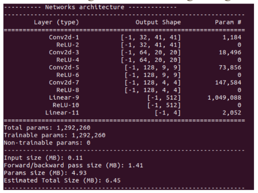
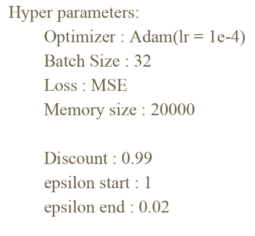
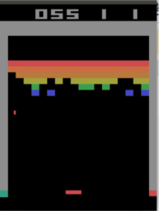
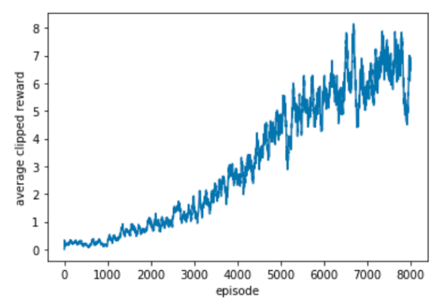

# Deep-Q-learning
Playing Atari Breakout with deep reinforcement learning

## reference paper
[Playing Atari with Deep Reinforcement Learning](https://arxiv.org/abs/1312.5602) 
(Volodymyr Mnih, Koray Kavukcuoglu, David Silver, Alex Graves, Ioannis Antonoglou, Daan Wierstra, Martin Riedmiller)

## model 

## hyperparameter

## Screen Capture and Learning Curve

